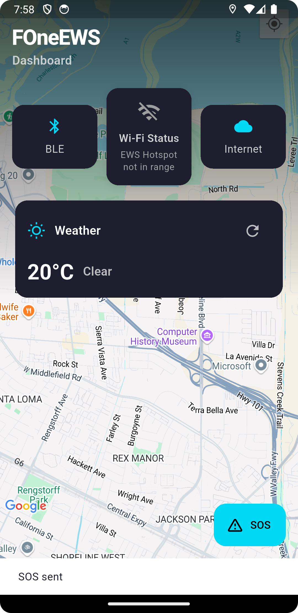
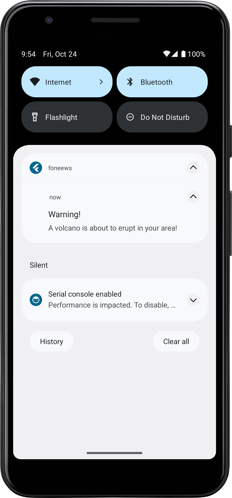
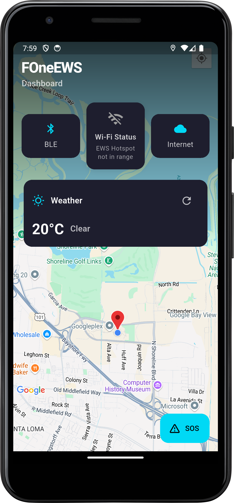
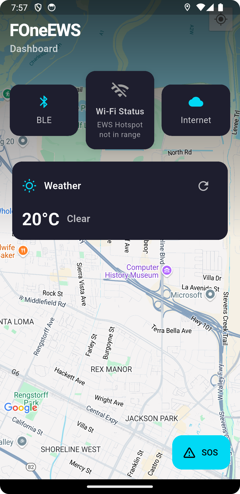
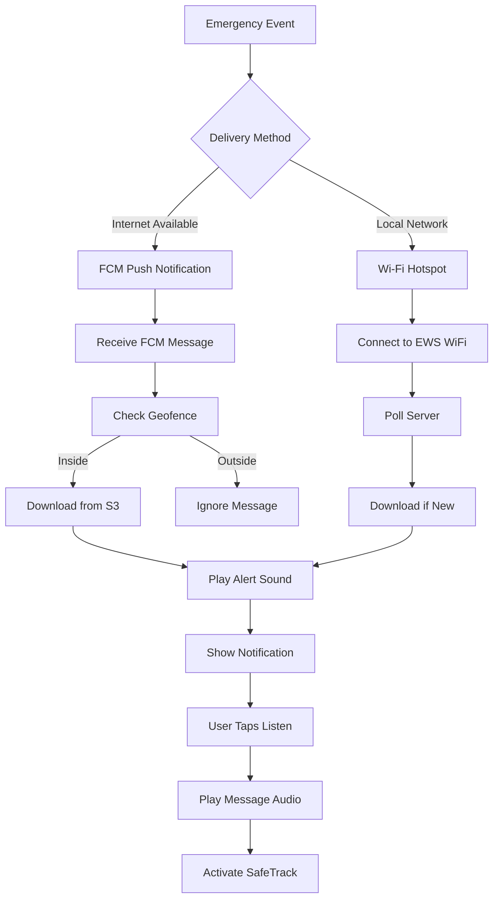

# foneews

# FOneEWS - Emergency Warning System Mobile App


## 📱 Overview

FOneEWS is a critical emergency warning system mobile application designed to deliver time-sensitive emergency alerts to users through multiple redundant channels. The app ensures emergency messages reach users even in challenging network conditions by utilizing both cloud-based push notifications and local Wi-Fi hotspot connectivity.

## 🎯 Key Features

### Dual-Channel Message Delivery
- **Cloud-Based Alerts**: Receives push notifications via Firebase Cloud Messaging (FCM)
- **Local Network Alerts**: Connects to predefined Wi-Fi hotspots for offline message delivery
- **Geofencing**: Only delivers alerts relevant to user's current location
- **Audio Alerts**: Plays distinctive alarm sounds based on message priority
- **Secure Messaging**: All messages are encrypted and authenticated

## 📸 Screenshots

### Main Dashboard

<p>*The main dashboard showing system status, weather information, and quick access to emergency features*</p>

### Alert Notification

<p>*Example of an emergency alert notification with the "Listen" action button*</p>


### SafeTrack Active

<p>*SafeTrack location sharing activated after receiving an emergency alert*</p>

### Wi-Fi Status

<p>*Wi-Fi service status showing connection to EWS hotspot*</p>


## 🔧 How It Works

### 1. Firebase Cloud Messaging (FCM) Channel

The app continuously listens for FCM push notifications containing emergency alerts. When a notification arrives:

```
1. Message Reception
   ├── FCM notification received with:
   │   ├── Message ID (for deduplication)
   │   ├── Encrypted polygon coordinates
   │   ├── S3 key for audio file
   │   └── Priority level (1-3)
   │
2. Geofence Validation
   ├── Decrypt polygon coordinates
   ├── Get current device location
   └── Check if user is within alert zone
   │
3. Audio Download
   ├── Generate AWS V4 signed URL
   ├── Download MP3 from S3 bucket
   └── Validate audio file integrity
   │
4. Alert Presentation
   ├── Play priority-based alarm sound
   ├── Show system notification
   ├── Offer "Listen" action
   └── Activate SafeTrack if accepted
```

### 2. Wi-Fi Hotspot Channel

For areas with limited internet connectivity, the app can receive alerts via local Wi-Fi:

```
1. Network Discovery
   ├── Scan for "EWS" SSID
   ├── Auto-connect with credentials
   └── Monitor connection status
   │
2. Message Checking
   ├── Poll local server endpoint
   ├── Check message ID for updates
   └── Download if new message available
   │
3. Local Delivery
   ├── Save audio file locally
   ├── Play alert sound
   └── Show notification to user
```

## 🛠️ Technical Architecture

### Core Technologies
- **Framework**: Flutter (Dart)
- **Push Notifications**: Firebase Cloud Messaging (FCM)
- **Cloud Storage**: AWS S3 with V4 signatures
- **Encryption**: AES-256-ECB for polygon data
- **Location Services**: GPS/Network geolocation
- **Audio**: just_audio package for MP3 playback
- **Local Notifications**: flutter_local_notifications

### Key Services

#### S3Service
- Generates AWS V4 signed URLs for secure downloads
- Handles path-style URLs for buckets with dots
- Validates downloaded audio files
- Manages local file cleanup

#### FCMService
- Processes push notifications in foreground/background
- Handles message deduplication
- Manages notification permissions

#### GeoFenceService
- Decrypts polygon coordinates
- Uses geodesic calculations for accurate boundary checking
- Handles both simple and complex polygon shapes

#### SafeTrackService
- Activates location sharing after alert receipt
- Sends encrypted location updates via MQTT
- Auto-expires after 60 minutes

#### WiFiService
- Auto-connects to EWS hotspots
- Polls for new messages every 10 seconds
- Handles Android/iOS platform differences

## 📋 Installation

### Prerequisites
- Flutter SDK 3.0+
- Android Studio / Xcode
- Firebase project with FCM enabled
- AWS account with S3 bucket configured

### Setup Steps

1. **Clone the repository**
```bash
git clone https://github.com/blessedrt/foneews.git
cd foneews
```

2. **Install dependencies**
```bash
flutter pub get
```

3. **Configure Firebase**
- Add `google-services.json` (Android) to `android/app/`
- Add `GoogleService-Info.plist` (iOS) to `ios/Runner/`

4. **Set environment variables**
```bash
flutter run \
  --dart-define=AWS_ACCESS_KEY=your_key \
  --dart-define=AWS_SECRET_KEY=your_secret \
  --dart-define=AWS_BUCKET=your_bucket \
  --dart-define=AWS_REGION=your_region \
  --dart-define=POLYGON_KEY=your_32_char_key \
  --dart-define=MQTT_USERNAME=your_username \
  --dart-define=MQTT_PASSWORD=your_password
```

5. **Run the app**
```bash
flutter run
```

## 🔐 Security Features

### Message Security
- **Encryption**: All polygon data encrypted with AES-256
- **Authentication**: AWS V4 signatures for S3 access
- **Deduplication**: Prevents replay attacks
- **Geofencing**: Location-based access control

### Network Security
- **HTTPS/SSL**: All cloud communications encrypted
- **Certificate Pinning**: (Optional) For enhanced security
- **Local Storage**: Temporary files auto-deleted after 24 hours

## 🧪 Testing

### Unit Tests
```bash
flutter test
```

### Integration Tests
```bash
flutter test integration_test
```

### Manual Testing Checklist
- [ ] FCM notification received in foreground
- [ ] FCM notification received in background
- [ ] FCM notification received when app terminated
- [ ] Audio downloads successfully from S3
- [ ] Alert sound plays correctly
- [ ] Geofence correctly filters messages
- [ ] Wi-Fi auto-connects to EWS hotspot
- [ ] SafeTrack activates after message
- [ ] Old audio files are cleaned up

## 📊 Message Flow Diagram



## 🚨 Alert Priority Levels

| Priority | Alert Sound | Use Case |
|----------|------------|----------|
| 1 | Single tone | Low urgency informational |
| 2 | Double tone | Moderate urgency |
| 3 | Continuous alarm | High urgency/immediate action |

## 📱 Platform Specific Notes

### Android
- Requires notification permission (Android 13+)
- Supports background message processing
- Auto-connects to Wi-Fi networks
- Requires exact alarm permission for scheduled tasks

### iOS
- Requires notification permission on first launch
- Background processing limited by iOS
- Manual Wi-Fi connection required
- Location permission needed for geofencing

## 🐛 Troubleshooting

### Message Not Received
1. Check internet/Wi-Fi connectivity
2. Verify notification permissions granted
3. Ensure location services enabled
4. Check if within geofence boundary
5. Verify S3 bucket accessibility

### Audio Not Playing
1. Check device volume settings
2. Verify audio file downloaded successfully
3. Check audio permissions
4. Ensure sufficient storage space

### S3 Download Failures
1. Verify AWS credentials are correct
2. Check bucket name and region
3. Ensure IAM permissions include s3:GetObject
4. Verify system time is accurate (for signatures)

## 📄 License

This project is licensed under the MIT License - see the [LICENSE](LICENSE) file for details.

## 🤝 Contributing

1. Fork the repository
2. Create your feature branch (`git checkout -b feature/AmazingFeature`)
3. Commit your changes (`git commit -m 'Add some AmazingFeature'`)
4. Push to the branch (`git push origin feature/AmazingFeature`)
5. Open a Pull Request

## 📞 Support

For issues, questions, or suggestions:
- Open an issue on GitHub
- Email: support@foneews.app
- Emergency technical support: +1-XXX-XXX-XXXX

## 🔄 Version History

### v1.0.0 (Current)
- Initial release with dual-channel delivery
- FCM and Wi-Fi hotspot support
- Geofencing capability
- SafeTrack location sharing

### Roadmap
- [ ] Multiple language support
- [ ] Offline map caching
- [ ] Message history
- [ ] Family group notifications
- [ ] Wearable device support

## ⚠️ Disclaimer

This emergency warning system is designed to complement, not replace, official emergency alert systems. Always follow official emergency guidance from local authorities.

---

**Built with ❤️ for public safety**

